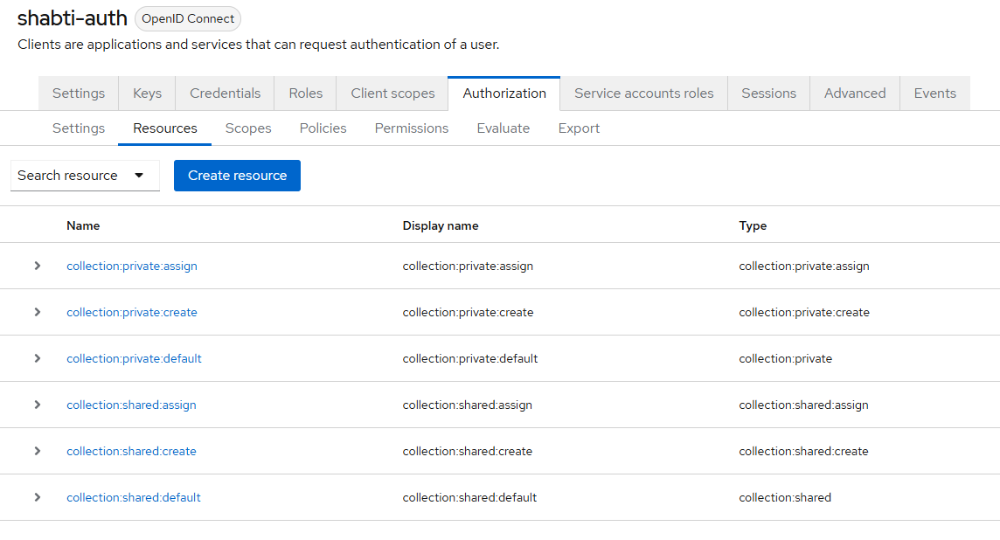

# Shabti Security and RBAC Features

Shabti can run on a local machine without any security controls, but if you're exposing it to a network it is strongly advised that you enable security to protect your instance. You get the following features:

- **TLS/HTTPS encryption:** connections to Shabti will be encrypted using TLS meaning that they use HTTPS rather than HTTP, preventing malicious actors from viewing the data being sent through the connection.
- **RBAC:** users must have a valid account to use Shabti. The administrator can configure different access levels for different users. Many 3rd party identity providers can be linked to Shabti negating the need to set up separate user accounts if you already have an identity management system in place.

## TLS Certificate Management

During the install process Shabti automatically generates all the certificates required to use TLS encryption. There are what are known as self-signed certificates, meaning they are not registered on the internet and are really only suitable for internal use. By default, most browsers will display an error using this type of certificate as they are not signed by any recognized Certificate Authority. You generally have to expand the error to find the option to proceed anyway. It is usually fine to do this if you're accessing the local machine or a machine on your intranet. It is however possible to add these certificates to your trusted certificates to remove the error.

After installing Shabti you will find a directory called `self_signed_certificates` in the same location as the executable. The file called `root-ca.pem` is the Certificate Authority certificate which has been used to create and sign the other certificates. Depending on your operating system there are different processes to add a certificate to the trusted certificate store. Once you have trusted `root-ca.pem` you should be able to freely access Shabti from your web browser. You will need to add the certificate to the trusted store on all machines that will access Shabti.

## RBAC

RBAC stands for Role-Based Access Control. We're using Keycloak to provide this feature which is a great open-source tool for identity and access management. It's very flexible and comes with a great amount of documentation: https://www.keycloak.org/guides, https://www.keycloak.org/documentation.

When you enable Shabti security we instantiate a Keycloak container in Docker which you can access at https://localhost:8443, replace localhost with the address of your server if accessing it remotely.

> [!NOTE]  
> If you click the link from Docker Desktop it doesn't use the HTTPS protocol so the page won't load, you must enter the URL yourself into the browser being sure to start it with "https"

To log in you must use the username "admin" and the password you provided during setup. This account is the super admin. The super admin user only serves to administrate the Keycloak instance, they do not have any permissions to access Shabti as a user. You will see a recommendation to configure a definitive admin account and disable this one, it is advisable to do so!

Most of the relevant configuration options can be found in the "shabti" realm rather than the "master" one which is selected by default, be sure to select the right realm using the "Manage realms" button. 

Most of the authorization settings can be found within the "shabti-auth" client which you can access by clicking the "Clients" button once you are in the "shabti" realm.

### Shabti Collections in Keycloak

When using Shabti security features, you can create collections either as "shared" or "private". It isn't currently possible to change this property on an existing collection, although that is on our roadmap. A shared collection will be usable by and user with shared collection permissions, a private collection can only be used by the user who created it (and admins).

A fresh Shabti instance will already contain a few Authorization resources as these are needed to assign permissions across all collections including those which haven't been created yet.

You should not remove any of these!

The resources with the ":default" suffix exist to allow you to assign permissions to the resource type as a whole. Keycloak does not allow you to manage permissions for a resource type if no resources of that type exist.

The "create" and "assign" resources for each collection type represent the ability to create that collection type and to set the owner of a collection. When a user has the ability to create a shared collection, that collection will be viewable and/or editable by any users with the relevant permissions for shared collections. A private collection can only be accessed by its owner and admin users, unless of course you modify the configuration to allow other users to access it. 

> [!CAUTION]
> The private collection resource type refers to all private collections, if you assign a user permission to access the "collection:private" type they will have access to all private collections, not just their own! See the script in "is-owner-policy" in the "Policies" tab to see how we've achieved access specifically to the user's own collections

The "assign" resource means the user can create a collection on behalf of a different user. This is currently only used when creating collections with the command-line tool.

When a collection is created in Shabti it will show up in the list of Resources. It isn't advisable to delete them directly from the Keycloak admin console as they are linked to data elsewhere in the tech stack which will not be removed. To delete a collection please go through the Shabti web interface or use the command-line.

### Roles

Now that we have explored the resource types, let's get to the interesting part: Roles!

To view existing roles, use the "Roles" tab under the "shabti-auth" client.

"uma_protection" is a built-in role which allows Shabti to look up permissions for authorization resources, you should on no account delete this role!

The other roles are designed to let you use Shabti with several different access levels for your users. We think that for many use cases these roles will be sufficient, but you can of course add more or modify the existing ones if you need to. The Keycloak documentation explains how to manage roles and permissions.

- **admin**: grants full control over all collections, use sparingly!
- **private_collection**: allows the user to create, manage and delete their own private collections. Only admins can access other users' private collections.
- **shared_read**: these users can view documents in shared collections, and use them in queries, but they cannot create, modify or delete the collections.
- **shared_read_write**: these users can create, modify and delete shared collections as well as use them in queries. This applies to *all* shared collections, so be careful when assigning this role!

### User Accounts

We won't go into too much detail here as there are many possible configurations for managing user accounts, and the Keycloak documentation can help you set up the right one for your situation.

We strongly recommend using your existing organization accounts where possible as Keycloak is great at integrating with existing identity platforms, and it is generally more secure to let a dedicated provider manage your accounts rather than trying to roll your own solution.

Keycloak provides pre-configured connectors for many of the popular identity providers such as Microsoft, Google and Github, you can find these under "Identity Providers"/"Social", you will also see on the "Identity Providers" panel that there are several options to create custom configurations for popular protocols such as OpenID Connect, the vast majority of identity providers are compatible with at least one of these options.

In addition to this in the "User federation" panel you will find connectors for Kerberos and LDAP which should cover a lot of on-premises needs.

It is also possible as a last resort to create accounts directly in Keycloak, features such as email verification and multi-factor authentication are supported and encouraged!

## Security Demo

You may have noticed that you can set the security level to "Demo" when setting up your Shabti instance. This is provided so you can get a preview of the security features without having to go through any configuration steps. This is not secure at all and should never be used on a public facing network! We mostly use this for testing during development, and we have provided it publicly so you can see the potential of using RBAC with Shabti.

When installing with the Demo security level, the following accounts are created:

- **testadmin**: has "admin" role
- **testprivate**: has "private_collection" role
- **testshared**: has "shared_read_write" role
- **testsharedread**: has "shared_read" role
- **testnothing**: has no roles at all, if Keycloak is correctly configured this user can't do anything

The password for all these users is just "test" and there is no verification of any sort in place. That is why you absolutely must avoid using this configuration in production or on any public-facing network. It's best to keep it restricted to the local machine only!